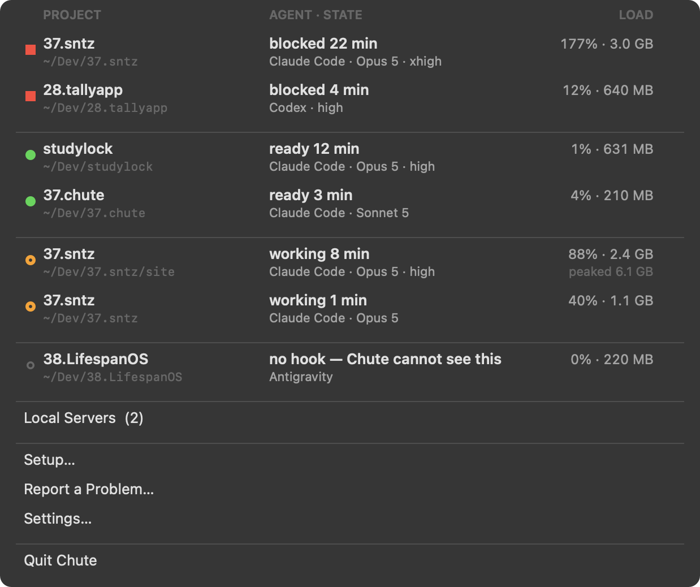
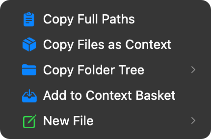
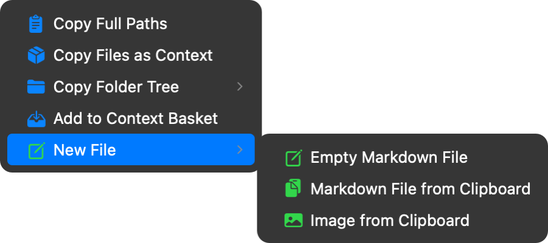
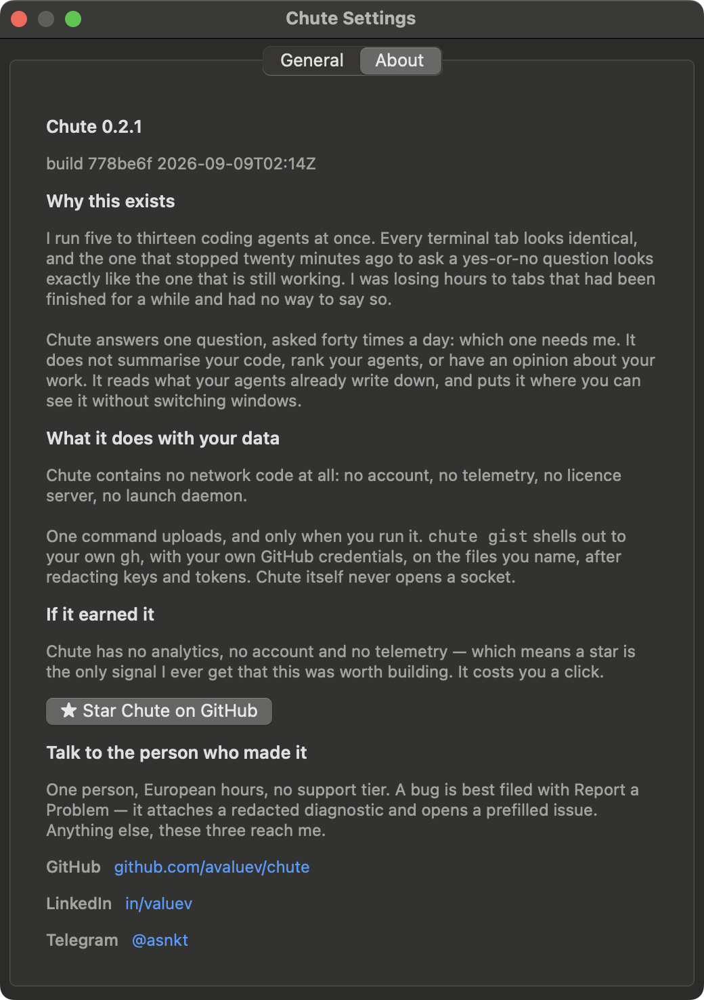

# Chute

[](https://github.com/avaluev/chute/actions/workflows/macos-matrix.yml)
[](LICENSE)

**The Finder right-click menu and the menu bar, for people who run coding agents all day.**

Two surfaces. Right-click a Finder selection to put it on the agent's clipboard as agent-ready
context — files, paths, a folder tree. Watch the menu bar for which of your terminal sessions is
blocked or waiting on you, and see every local server without hunting for what is holding port
3000.

Offline. Zero telemetry. No account. No launch daemon, no background service, and no network code
beyond one command, `gist`, that uploads only when you run it yourself.



---

## The Finder menu



Right-click a selection and the actions sit inline in the context menu — no `Chute ▸` submenu to
open first. Five rows, nine actions:

- **Copy Files as Context** — every file's contents in one blob (XML or Markdown), with a token
  count, ready to paste at an agent.
- **Copy Full Paths** — clean absolute paths for a prompt.
- **Copy Folder Tree** — the directory's skeleton, junk excluded, one to all levels deep.
- **Add to Context Basket** — collect files across several folders over several minutes, then
  hand the whole set over once.
- **New File** — a blank Markdown file, or one built from what's on the clipboard, named from its
  own `# heading`.



> Both images above are **rendered**, not photographed: macOS will not let any program screenshot
> another application's open context menu. `Scripts/finder-shot.swift` draws them from
> `Sources/ChuteCore/FinderActions.swift` — the same table the extension builds the real menu
> from — so they cannot show a row the Finder menu does not have. The terminal section at the
> bottom of this page shows how to print the same list yourself and compare.

The Finder menu is a sandboxed `FIFinderSync` extension inside the app. `install.sh` registers and
enables it for you; if it ever goes missing, tick it in System Settings → Privacy & Security →
Extensions → Finder → ☑ Chute, or run `pluginkit -e use -i dev.valuev.chute.finder`.

---

## The menu bar


Click the 🪂 for the list of every terminal running an agent: project name and the path it was
derived from, its state and how long it's held it, its load — a dot whose shape carries the state
(filled square = blocked, filled circle = ready, ring = working), never a colour keyed to the
project. Click a row to bring that terminal forward, or use the `⌥⌘N` hotkey from anywhere.

The badge needs hooks to be interesting, and wiring them is your call, made by your hand. Without
them, a session reads `unknown` — "no hook, Chute cannot see this" — never a guessed state, and the
badge stays dark either way, since a pip only lights for a live hook saying `blocked`, `waiting` or
`working` (`Sources/ChuteCore/StateResolver.swift`, `Sources/ChuteCore/MenuBarMark.swift`). With
hooks wired, Claude Code reports `blocked` (a permission prompt) and `waiting` (your turn) as they
happen. Only live terminals count toward the badge: a hook record from a window you have since
closed is ignored, so the number never inflates behind your back.

**Chute never writes to `~/.claude/settings.json` — or to any other tool's configuration.** Your
agent setup is fragile and it is yours; no menu-bar utility should be editing it, however
carefully. It prints the hook snippet, and the whole settings file it would produce, on STDOUT —
you paste it. Wiring steps live in the app's Settings → General tab, and in the terminal section
near the bottom of this page.

### What is running locally

The menu bar lists every local server, so you never again hunt for which of six terminals holds
port 3000:

```
Local servers (8)
  :3000 · next · studylock       ▸ Open in Browser · Copy the URL · Stop It (kill 55868)
  :5432 · postgres
```

Each row names the port, what the process actually is, and the project folder it is running in,
and says whether it is reachable from your whole network or only from this Mac. macOS's own
background listeners (AirPlay on 7000, `rapportd` on a random high port) are left out — they are
never what the question "what is running?" means.

---

## Install

**You need:** macOS 13 (Ventura) or later, on an Apple Silicon Mac (M1 and up). Nothing else — no
Xcode, no Apple account, no licence key. The build takes about a minute.

### The one command — recommended, and fine if you have never used a terminal

1. Press <kbd>⌘</kbd><kbd>Space</kbd>, type `Terminal`, press <kbd>Return</kbd>.
2. Copy the line below, paste it into that window, press <kbd>Return</kbd>:

```bash
curl -fsSL https://chutedev.com/install.sh | sh
```

3. Wait about a minute. It prints what it is doing and finishes with `Chute installed.`
4. Look for the 🪂 in your menu bar, at the top-right of the screen. That is Chute running.

It downloads the source, compiles it **on your Mac**, installs the app and switches the Finder
menu on. Because your own compiler built it, macOS never flags it as downloaded and Gatekeeper
never blocks it — which is the whole reason this is the recommended path rather than the .dmg.
Piping a stranger's script into a shell deserves a look first:
[read it here](https://chutedev.com/install.sh) — it is about forty lines.

### Every other way in

| You want | Do this | You get |
|---|---|---|
| **Your agent to do it** | Paste at Claude Code, Codex, Cursor: `Set up Chute for me — https://github.com/avaluev/chute` | The app. It reads this page, installs, and asks before touching your agent config. |
| **A download, not a terminal** | [Get `Chute-<version>.dmg` from the latest release](https://github.com/avaluev/chute/releases/latest), open it, drag Chute to Applications | The app — **but see Gatekeeper below**, macOS will refuse it on the first try. |
| **To build from a clone** | `git clone https://github.com/avaluev/chute.git && cd chute && ./Scripts/install.sh` | The app. Rebuilds automatically if the checkout has moved on. |
| **Only the terminal tool** | `brew install avaluev/tap/chute` | The `chute` command and **nothing else** — no menu bar, no Finder menu. |

> **Homebrew does not install the app.** The formula builds the command-line binary only. If you
> want the two surfaces this page is about, use one of the first three rows.

### If you downloaded the .dmg: getting past Gatekeeper

Chute has no Apple Developer ID, so a downloaded copy is unsigned and macOS will say it *"cannot
be opened because Apple cannot check it for malicious software."* The dialog offers **Done** and
**Move to Trash** — neither of which opens it. To open it anyway:

1. Right-click (or Control-click) `Chute.app` in Applications → **Open**.
2. The same warning appears, but this time with an **Open** button. Click it.
3. If that does not appear: **System Settings → Privacy & Security**, scroll down, and click
   **Open Anyway** next to the message about Chute.

Verify the download first if you like — every release ships a checksum:

```bash
shasum -a 256 -c Chute-*.dmg.sha256
```

None of this applies to the one-command or clone installs. Nothing is downloaded, so nothing is
quarantined.

### What macOS will ask you, and why

- **"Chute wants to control Finder / System Events"** — the app is what performs a Finder action;
  the extension itself is sandboxed and can only file a request. Decline it and the menu rows go
  quiet. Grant it in **System Settings → Privacy & Security → Automation**.
- **The Finder menu is missing** — tick it under **System Settings → Privacy & Security →
  Extensions → Finder → ☑ Chute**, or run `pluginkit -e use -i dev.valuev.chute.finder`.
- Chute asks for **no** disk, network, camera, microphone or location permission, and there is
  nothing to sign in to.

### Uninstall

```bash
./Scripts/uninstall.sh
```

Removes the app from both `~/Applications` and `/Applications`, unregisters the Finder extension,
and strips the hook block from your agent config. If you installed with Homebrew, that binary is
separate: `brew uninstall chute`.

Prefer a terminal to a right-click? The same engine runs on its own — see
[The command-line tool](#the-command-line-tool) near the bottom of this page.

---

## Why

Running agents 10 hours a day means paying a tax on every loop:

| You do this | Times a day | By hand | With Chute | Saves |
|---|---|---|---|---|
| Feed it a folder, one file at a time | 17 | 150 s | 5 s | **41.1 min/day** |
| Paste the clipboard into a new file | 25 | 35 s | 4 s | 12.9 min/day |
| Type a file path into a prompt | 32 | 20 s | 3 s | 9.1 min/day |
| Collect files across folders, then hand them over | 12 | 45 s | 4 s | 8.2 min/day |
| Show it the shape of a folder | 10 | 30 s | 3 s | 4.5 min/day |
| Find out what is holding port 3000 | 11 | 30 s | 3 s | 4.9 min/day |

That is **~80 minutes a day** — 80.7, for the app's own surface. Every figure comes from
[`site/src/lib/cases.ts`](site/src/lib/cases.ts), which `site/scripts/check-cases.mjs` re-derives
from [`docs/03-JTBD-LEDGER.md`](docs/03-JTBD-LEDGER.md) on every build.

Two honest notes, because they are the first things a sceptic asks. **These are timings of one
person's workflow**, not a study. And the free MIT CLI carries another 75.3 min/day of its own —
the 156.0 total is real and it is not a number to wave at a buyer, because two thirds of it costs
nothing.

---

## Safety

Chute is built to be trusted with a repo an agent is about to rampage through.

- **`clean` previews by default.** Nothing is deleted without `--force`.
- **`checkpoint` cannot lose work.** It stages into a private index file, so your real index,
  your worktree and `HEAD` are never touched. It only ever adds a branch.
- **`new` and `seed` never overwrite.** Collisions become `-2`, `-3`.
- **`clean` moves files to the Trash**, never `rm`.
- **`env inject` reads the Keychain only**, prints key names but never values, and refuses to
  create a `.env` that git would track.
- **No network code at all.** `grep -rn 'URLSession\|NSURLConnection' Sources/` returns nothing.
  One command, `chute gist`, uploads — by shelling out to your own `gh`, with your own
  credentials, on the files you name, after redacting keys and tokens. Chute never opens a socket.

---

## How this was built

Six weeks, one person, coding agents doing most of the typing — and about a fifth of the repository
by volume is the machinery that checks the other four fifths.

That ratio is the whole finding. Agents made writing code cheap and left the cost of trusting it
exactly where it was, so the interesting engineering moved into the gates:

| Gate | What it checks that a normal test does not |
|---|---|
| [`Scripts/check-metrics.sh`](Scripts/check-metrics.sh) | a **magnitude** against something physical — RAM, cores, a load of known size. Written after a CPU figure shipped 24× wrong with every shape assertion green |
| [`Scripts/check-untested-logic.sh`](Scripts/check-untested-logic.sh) | decision points in targets no test can import may **shrink freely and never grow**. Written after a one-line bug shipped past 917 green assertions |
| [`Scripts/acceptance.sh`](Scripts/acceptance.sh) | all 9 Finder actions against a hostile tree — symlink loops, 10 MB files, quotes in filenames |
| [`site/scripts/check-claims.mjs`](site/scripts/check-claims.mjs) | every published claim against the **artifact that implements it** — the CLI's dispatch switch, `du` on the bundle, `spctl` on the app. Not against a list a human maintains |

The method, the five ways a green suite lied, and the seven rules that came out of it are written
up in full:

**→ [The harness is the product](docs/BUILDING-WITH-AGENTS.md)** — how to build this way,
with every bug that taught each rule.

Two companion documents, both decision memos rather than narrative:

- [Can I sell a DMG without an Apple ID?](docs/APPLE-AND-DISTRIBUTION.md) — the Gatekeeper
  wall measured in clicks, the Homebrew cask deadline of 2026-09-01, and the arithmetic that
  settles it
- [`handoff/NEXT.md`](handoff/NEXT.md) — the live state of the project, including what is broken

## Development

```bash
swift build -c release                # build
swift run -c release chutetests       # the unit suite
CHUTE_HEADLESS=1 ./Scripts/smoke.sh   # the CLI end to end, no GUI
./Scripts/smoke.sh                    # + the Finder/Terminal sections
./Scripts/build-app.sh                # assemble Chute.app, stamped with the git SHA
./Scripts/screens.sh                  # render every screen (menu, about, settings, setup) to PNG
```

`./Scripts/screens.sh` is how the screenshots in this README and on the site are produced — from
the shipping build, not redrawn by hand. Run it after any change to what a window shows, or it
looks current and is not. `./Scripts/reinstall-if-stale.sh` runs as a Stop hook
(`.claude/settings.json`) and rebuilds `/Applications/Chute.app` (or `~/Applications`, whichever is
actually installed) whenever its stamp is behind `HEAD` — it refuses when the tree does not build
or the suite is red, so a look at the running app is never four commits behind the code that was
just verified.

The tally each of those prints lives in `docs/FACT-SHEET.md` §Verification, and only
there. This block used to carry its own copies — "751 assertions", "128 passed" — and both were
wrong by the time anyone read them. Run the gate and read its tally; a count copied into a second
file is a count nobody re-derived.

No third-party dependencies. Builds with Command Line Tools — Xcode is not required.
`swift test` is unavailable on a CLT-only toolchain (XCTest ships with Xcode), so the suite is a
plain executable with an assert harness instead.

Specs live in [`docs/`](docs/): business requirements, FR/NFR, the JTBD ledger, the customer
journey map, and the definition of done. Two documents for anyone changing code rather than
copy: [`docs/ARCHITECTURE.md`](docs/ARCHITECTURE.md) — the three build targets, why the split
exists, and the two shipped bugs that taught the rule — and
[`docs/SCRIPTS.md`](docs/SCRIPTS.md), which covers every script and gate above: what each
measures, what a red run means, and what it cannot catch.

---

## Open source

Chute is MIT, all of it — the app, the Finder extension, the CLI, the site. Read it, fork it, take
the bits you want. Issues and pull requests are welcome, and there is no contributor agreement to
sign — see [`CONTRIBUTING.md`](CONTRIBUTING.md) for how to build and which gates a PR needs, and
[`SECURITY.md`](SECURITY.md) for the one command that uploads anything and how to report an issue.



The same links are in the app itself — Chute menu bar → Settings → About.

---

## The command-line tool

**Free and MIT, forever. Same engine as the app, for people who prefer a terminal to a
right-click.** It is not a second product competing with the two surfaces above — it is the
objection-handler: read the source, run it, and decide for yourself before you trust an app built
on top of it.

```bash
brew install avaluev/tap/chute
```

```bash
# context in — select files in Finder, or name them
chute paths src/*.ts                 # clean absolute paths → clipboard
chute bundle src/ --format xml       # every file's contents in one blob + token count
chute tokens src/                    # will this fit the window?

# work safely
chute checkpoint .                   # snapshot everything, including untracked files
chute sandbox spike-auth --yolo      # folder + git + CLAUDE.md + terminal running claude

# artifacts out
chute basket add src/*.ts            # collect files across folders
chute basket copy --format context   # hand them over to the agent
chute new                            # clipboard → a correctly named, correctly typed file
chute diff . --copy                  # what did the agent actually change?
```

### Every command

| Command | Does |
|---|---|
| `chute paths <files…>` | Absolute paths for a prompt. `--format posix\|quoted\|relative\|at` |
| `chute bundle <files…>` | Files + contents in one blob. `--format xml\|md` |
| `chute tokens <files…>` | Estimated token cost, per file and total |
| `chute tree [dir]` | Directory skeleton, junk excluded. `--depth N` |
| `chute new` | Clipboard → new file, named from its `# heading`, extension from its syntax |
| `chute seed [dir]` | `CLAUDE.md`, `.cursorrules`, `AGENTS.md`, `SCRATCHPAD.md`. Never overwrites |
| `chute note "…"` | Append to `SCRATCHPAD.md` — where you left off |
| `chute latest [dir]` | Reveal the newest artifact. `--quicklook` |
| `chute clean [dir]` | List agent scratch files. **Lists by default**, Trashes with `--force` |
| `chute sandbox [name]` | Folder + git + rules + terminal + agent. `--agent claude\|codex\|gemini --yolo --each` |
| `chute open [dir]` | Terminal or editor here. `--with terminal\|editor` |
| `chute ports` | Every local server: port, what it is, which project, reachable from where. `--kill 3000` |
| `chute checkpoint [dir]` | Snapshot before the agent runs — never touches your worktree |
| `chute diff [dir]` | What changed. `--copy` puts the patch on the clipboard |
| `chute redact` | Mask API keys and tokens before sharing |
| `chute gist <files…>` | Secret gist, URL on the clipboard |
| `chute dataurl <image>` | Base64 data URL for vision prompts. `--markdown` |
| `chute basket add\|list\|copy\|clear` | Collect files across folders, hand them over once — `copy` gives `@mentions` or the files themselves |
| `chute prompt decompose\|ponytail` | Prompt templates: split work into 15-min tasks; cut over-engineering |
| `chute env inject [dir]` | Keychain → `.env`. Refuses unless `.env` is gitignored |
| `chute sessions` | Every terminal session, grouped by state. `--json` |
| `chute focus <key\|project\|N>` | Bring that session to the front. Asks when a name matches several |
| `chute hooks status\|snippet\|merged\|uninstall` | Agent status hooks. `merged` prints your settings with them added; Chute never writes that file — the command it gives you does |
| `chute resume [key\|N]` | The command to pick that conversation up again. `--tmux` |
| `chute doctor` | Check the install and say how to fix what fails. `--fix --json` |
| `chute onboard` | What Chute is, and the first thing to try |

Add `--no-copy` to any command to keep the clipboard untouched.

### Sessions and hooks, from a terminal

The menu bar's session list and its hook wiring are both one command away, for anyone who would
rather check a terminal than open the menu:

```bash
chute sessions          # → 9 session(s), 2 need you
chute focus studylock   # by project name — asks if several match, never guesses
chute focus 3           # or by the number sessions printed
chute doctor            # what is not wired up yet, and the exact fix
```

```bash
chute hooks status            # read-only: what is wired now
chute hooks snippet           # prints the JSON, AND the one command that merges it for you
chute hooks merged            # your whole settings.json with the hooks added — on STDOUT.
                              # Chute never writes that file; the command `snippet` prints
                              # pipes this into place, backing yours up first
chute hooks uninstall         # removes exactly the blocks OLD Chute versions added (≤0.1.0
                              # wrote them) — backs up first, touches nothing of yours
```

The hook commands themselves only ever write to `~/.chute/sessions/` and always exit 0, so a
Chute failure can never break an agent session.

Every command, with what it does: `chute help` in your terminal, or the reference at
[chutedev.com/docs](https://chutedev.com/docs).

---

## Licence

**MIT. All of it** — the CLI, the menu-bar app, the Finder extension, the scripts, the site.

Chute was open-core for eleven days: the app was paid, with a trial and an offline licence key,
and `Sources/ChuteApp/`, `Sources/ChuteFinder/` and `Resources/` each carried their own
all-rights-reserved `LICENSE`. That ended on 2026-09-08. The licence check, the trial clock and
the Cloudflare Worker that minted keys were **deleted rather than switched off**, and
`Scripts/smoke.sh` now fails the build if `isUnlocked`, `Trial.` or `License.` reappears anywhere
in `Sources/` — so the gate cannot come back by accident.

[`LICENSE`](LICENSE) is the authoritative version and is now the plain MIT text with no scope
preamble, which is also what makes GitHub report this repository as MIT rather than "Other".
